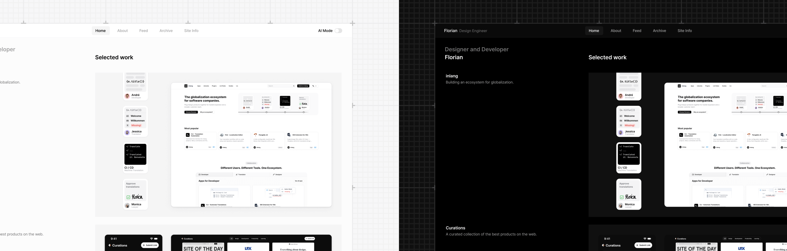

<a href="https://github.com/flornkm/florians-site">
   
  </a>

  <h3 align="center">Florians Site</h3>

  <p align="center">
    Personal, open-source website of Florian.
    <br />
    <a href="https://floriankiem.com"><strong>Visit Site →</strong></a>
    <br />
    <br />
    <a href="https://twitter.com/flornkm">x.com</a>
    –
    <a href="mailto:hello@floriankiem.com">E-Mail</a>
    –
    <a href="https://floriankiem.com/colophon">Learn more</a>
  </p>
</p>

## About this project

This is the third big iteration of my personal website. I made my first one in 2019 and am hosting the files on GitHub since the beginning of 2022.

I'm a `design engineer`. That means, I'm both a creative and a logical thinker trying to combine both skills in one job.

### Copying this project

Although this repository is public, I'd like to ask you to not 1:1 copy my whole website. You can use it as a template /starting point, but please change the content and design to your own needs.

### Map of the site

> :bulb: **Info:** This could change from time to time.

```tree
├── !NAVIGATION (on all pages)
├── / (Home)
│   ├── Header introduction
│   ├── Work
│   ├── Contact chat
│   ├── Community letters
├── /about (About me)
│   ├── css
│   │   ├── **/*.css
│   ├── images
│   ├── js
│   ├── index.html
├── !FOOTER (on all pages)
└── .gitignore
```

## Contact me

As other design engineers, product designers or frontend developers, I'm quite active on `Twitter / X`. Feel free to give me a follow and conctact me over there: [@flornkm](https://twitter.com/flornkm).
