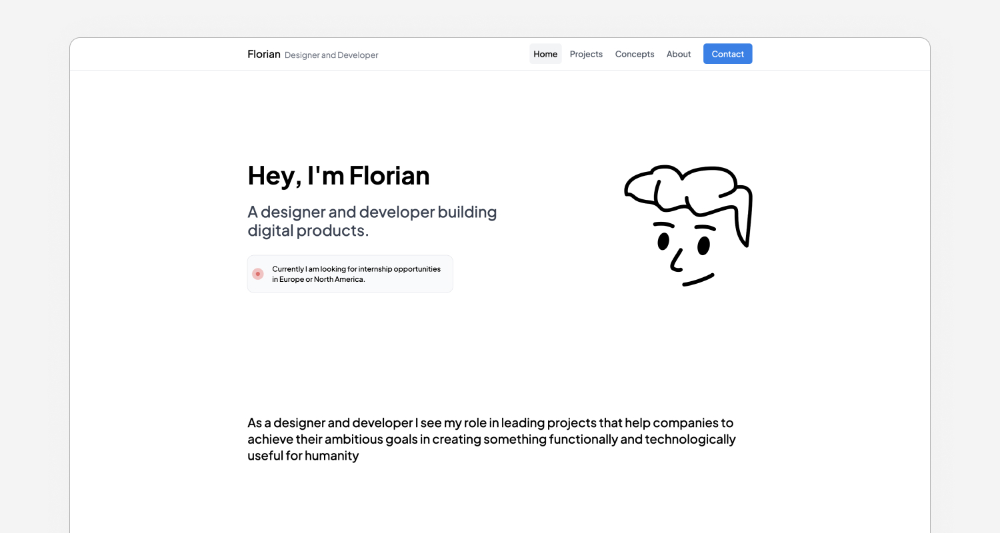

# Florians Portfolio

This is the source code to my portfolio, I hope that you can find some inspiration by looking at it. It was coded all from scratch by [myself](https://twitter.com/floriandwt) with [NextJS](https://nextjs.org/) and [TailwindCSS](https://tailwindcss.com/). [Rive](https://rive.app/) was also used on my [About page](https://designwithtech.com/about) to display my name in the way Apple did it with the "Hello" font.

